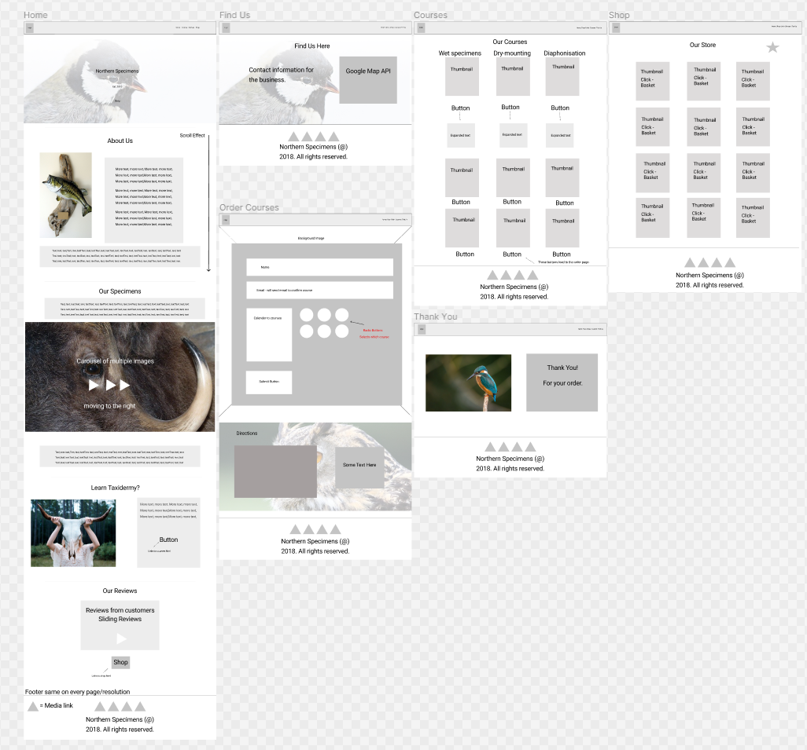

# Northern Specimens

## Northern Specimens is a fully interactive website that is designed to educate the user around Taxidermy, allow them to book a course to learn Taxidermy and to purchase items. This buisness aims to teach the public how to preserve animals in unique ways, while profiting from the interest of the public. I designed this website as me and my partner own a small taxidermy buisness and we will be using a similar design for our own website. This website aims to create as much profit and traffic to the business as possible, while creating a positive user experience.
The live version can be viewed [here](https://kittencode91.github.io/interactive-frontend/)
## **User Experience UX**
This website is for the buisness Northern Specimens, located in Northern England. They want to acheive an aesthetic and easy-to-use approach to a complicated and often taboo topic - Taxidermy. 
They wanted to achieve an attractive way of advertising products, pet preservation, their bespoke courses and social media. The website achieves these objectives by displaying wonderful images of taxidermy specimens, to catch the eye and give a positive experience for the user.
The website also has a shop, courses and orders page that allow the user to easily contact the buisness and to purchase anything advertised.

## User Stories
### First Time Visitor Goals
1. As a first-time customer/user, I want to easily understand the main purpose of the site and know what products I can purchase. 
2. I want to navigate the website easily, so I can find all the information I need to know and to buy the product/course I want/need. I want to revieve a confirmation email also.
3. I want to be able to get in touch with the buisness and look at their social media, look at any reviews to see if they are reliable/professional.
### Returning Visitor Goals
1. As a Returning Visitor, I want to be able to easily contact the site owner to check the status of my order.
2. I want to be able to book another course/make another purchase and check their social media.
3. I want to be able to use the Google API to locate my course/the buisness so I can plan my journey there. 
### Frequent User Goals
1. As a Frequent User, I want to be able to book anymore courses, advancing my skills through my learning.
2. I want to be able to make purchases of new products and contact the buisness about custom orders/pet preservation.
3. I want to be able to pass on information to third parties in regards to the buisness for potential collaborations and larger projects.

## Design

* The main colours used on the website are white, light-grey and black.
* The fonts used include: 'Cinzel', serif, 'Montserrat' and sans-serif;
* Imagery: The imagery is very aesthetic, many colourful photos give the website a minimal yet vibrant feel. All images are responsive to all devices.

## Wireframes.  Completed 27th September.

## All
.
## Desktop
.
## Tablet

## Mobile

## Features
* The index.html page is the home page of the site. The page is minimalist so that the images speak for themselves and the user is not over worked with too much text. A fully interactive nav bar is located to allow for full access to the rest of the site.
A simple design is used to create more focus on the business products themselves. Vibrant images increases the user experience and the memorability of the pages/site to increase return rates and traffic. 
* The shop.html page is set out with bootstrap grids and is fully responsive. The layout is simple to provide the user with easy browsing and minimal distractions. The user is directed to the book.html page to place an order when clicking "Buy" buttons.
* The courses.html page is set out similar to the shop page, however this page also has hidden text shown through interactive use of toggle functions. The courses are simply described so the user can understand everything easier, letting them pick a course suitable for them. The user is directed to book.html when clicking "Book Now".
* The book.html allows users to submit their details, place orders and contact the buisness. The form also sends the user an email with a template from Northern Specimens. The page also has a fully responsive and interactive Google Maps API so the user can locate their chosen course.
* The findus.html is a page with buisness contact information. This is for users who may not want to purchase anything but contact the buisness for general enquires and to visit them.
* The thank.html is directed from the book.html page and lets the user know an email is on its way.
* Fully responsive APIs, form, checkbuttons, carousels, reviews and date picker.
* The website is fully responsive on all device sizes such as desktop, tablet and phone.

### Future features
* Future features to include into the website would be a blog and checkout page.

## Technologies used:
Languages used: **HTML5, CSS3 and Javascript**
* The project relies heavily on the [Bootstrap 4.4.1 CDN](http://getbootstrap.com/) to simplify resolution responses across all media platforms, allowing full responsiveness for both text and images through fluid-containers, carousels and Bootstrap-grid.
* [Google Fonts](http://fonts.google.com/) and [Font Awesome libraries](http://fontawesome.com/6?next=%2F) used to allow a more unique design and variability than standard HTML/CSS3 font.
* [Hover.css](http://ianlunn.github.io/Hover) allows for an alteration of visuals such as font color, family and changes to other features such as button size etc upon the cursor passing over the object.
* [J Query](https://jqueryui.com/datepicker/) was used in features such as the date picker. CDNs contributed to many of the interactive features. 
* [Google Maps](https://developers.google.com/maps/documentation/javascript/overview) interactive API used to locate buisness and courses.
* [EmailJs](https://dashboard.emailjs.com/) used to send a confirmation email to the user once form has been submitted.
* [Git](http:///git-scm.com) was used as a browser add on to allow the commit of data to the repository from GitPod.
* [GitHub](http://github.com) was used to store the code after it was pushed from GitPod using Git.

## Testing

[W3C CSS Validator - complete](http://jigsaw.w3.org/css-validator/images/vcss-blue.png)

### First Time Visitor Goals
 **As a first-time customer/user, I want to easily understand the main purpose of the site and know what products I can purchase.**
1. Users are initially greeted with an enter page that has the companys name social media and a visual woodland background which hints at the carpentry element of the site.
2. Upon entering the site the user is met with a hero image and an about section, explaining the purpose and objectives behind the company.
3. The about page is easily accessible from the navigation bar and explains what Magnus Woodcraft is and the products they sell/design.

 **I want to navigate the website easily, so I can find all the information I need to know and to buy the product i need.**
1. The enter page has a singular button that says "take a walk" when the cursor hovers over it, to allow easy access to the site.
2. The navigation bar follows the user on all devices, the user does not have to scroll to the top of the page to click on this, instead the nav bar scrolls with them for convenience. Moreover, each link works and directs the user to their desired page, regardless of what page they are currently on.
3. The Order page is accessible from all pages of the site, a simple and easy to fill-out form is displayed. Each device will have a different background for the order form adding interactivity when altering the size of the browser page. The form upon completion is met with a thank you message and a notification to state the waiting time for completion of orders.
Also, the form will only be submitted when all fields are filled in appropriately and a genuine email address is included. 

 **I want to be able to get in touch with the buisness and look at their social media.**

1. An order form is clearly displayed on the order page, both orders and gneral enquiries can be submitted
2. The companies social media pages including, instagram, snapchat, youtube as well as email are linked on the borrom of every page.

#### Returning Visitor Goals
 **As a Returning Visitor, I want to be able to contact the site owner to check the status of my order.**
1. The companies social media accounts are accessible from the icons at the bottom of every page.
2. General queries can be submitted through the order form on the order page.

 **I want to be inspired by the buisness when desining my own product.**
1. The visuals on both the about and projects pages are easily viewed on all devices and resolutions.
2. Information about the main inspriations for the carpenters are mentioned on the about page, along with the carousel images to allow the customer to gain knowledge on these particular styles and what they look like.
3. The order form allows the attachment of files from the computers system drive, this is labelled as "send us your ideas", this allows the company and customer to share visual representations of custom orders. Giving maximum benefit to the carpenter when bringing absolute customer satisfaction.

 **I want to be able to easily access any information I may have missed on my first visit.**
1. The site is easily accessible for returning visitors as mentioned above.
2. The navigation bar allows easy access to all pages.
3. Information is displayed clearly on all pages and is easily readable on all devices.

### Frequent User Goals
 **As a Frequent User, I want to be able to trade with the business effectively, through the contact form.**
1. As mentioned previously the contact form is also for general contact and open to any questions returning customers may have.

 **I want to check back to their social media for any news/updates.**
1. The social media links are easily accesible through any page of the site, allowing the customer to check back for updates.
2. The companies pages on instagram, youtube and snapchat will also have daily updates that the customer can subscribe to.

 **I want to be able to pass on information to third parties in regards to buisness to buisness production deals.**
1. The projects page is meant to highlight the future and current potential of the business to other businesses that are experinced in the woodcrafting trades.
2. Restoration and larger, log cabin projects hightlight the ambition of the company and the vast experience of the carpenters that are adept across different branches of carpentry.
3. The site is visually responsive and attractive across all devices, allowing for easy referencing and a good first impression to willing tradesmen.

## Further testing
1. Navigation: Each navigational link directs the user to the desired page.
2. Navigation bar turns into burger button when screen size is reduced. On click menu links are all displayed. Below div moves down.
3. Image responses: Images on all pages are fully responsive and are increased/decreased to an appropriate size and resolution across all screen sizes.
4. Content position: All fonts, page sections, carousels, headings, sub-headings, text sections, images and order-form remain in their appropriate positions and do not over-lap eachother, their respective parent divs or misalign, regardless of screen size. This was achieved by clicking "Open Source" after every alteration in the CSS code and running the new code, whilst expending and shrinking the display screen.
5. Port 8000 was used to check the position of divs and test functionality to interactive APIs forms, menus and media links.
5. Order form was tested multiple times. The alert box is displayed with the form is submitted but only after the fields are filled in.
6. Tested on all screen sizes, samsung galaxy s10, desktop, tablet and multiple browsers.

* **Unfixed Bugs:** 
1. The some of the social media pages for this company do not exist yet.
2. The email submission is not validated as an email but will prevent form submission if the field is empty.
3. The form submission button on the book.html page will not stay centered.

## Deployment

**This project was deployed to GitHub Pages using the following:**

1. I Logged in to GitHub and located my GitHub Repository.
2. Clicked on the repository "Settings" Button.
3. Located the "GitHub Pages" Section.
4. Under "Source", I clicked "None" and selected "Master Branch".
5. The live URL was then presented after the page refreshed.

## Credits
* Code: Special reference to those that allowed for easy application of the carousels and their respective images. [Sitepoint creator - George Martsoukos](http://www.sitepoint.com/full-screen-bootstrap-carousel-random-initial-image/). Other code references and achknowledgements are listed in the style.css file. All HTML references are the same and are as follows:
* All media bootstrap containers, rows and columns instructed by [w3schools](https://www.w3schools.com/bootstrap/default.asp) [Again](https://www.w3schools.com/bootstrap/bootstrap_carousel.asp)
* [Navbar] Huge contribution to John Smilga (https://vanilla-js-basic-project-4-navbar.netlify.app/).
* [Responsive carousel images](https://www.w3schools.com/w3css/w3css_slideshow.asp//)my own images and decoration were added by me.
* [Coding the carousel using Bootstrap](https://www.w3schools.com/bootstrap4/bootstrap_carousel.asp) was used to establish the bootstrap coding for the carousel
* [Addition carousel coding tips](https://www.sitepoint.com/full-screen-bootstrap-carousel-random-initial-image/). By web developer George Martsouko was used to manipuate the position of the carousel to my liking.
* [Google Maps](/*https://developers.google.com/maps/documentation/javascript/marker-clustering?hl=en_US*/)[And](https://developers.google.com/maps/documentation/javascript/examples/map-simple*/)[More](*https://stackoverflow.com/questions/38662789/google-maps-js-example-not-showing) thank to user scaisEdge.
* [Date Picker](https://api.jqueryui.com/toggle/ ) and from [here](https://getbootstrap.com/docs/4.0/components/collapse/) and lots of tips from this [user](https://stackoverflow.com/questions/43168193/how-to-toggle-each-button-separately-on-multiple-buttons) Pablo.
* ### Content: All content was written by the developer.
* ### Media: All images were taken from [Pixabay](http://pixabay.com/), as they are royalty free and from Norther Specimens with exclusive permission (I own the company).
* ### Achknowledgments: To my mentor, code institute and my family for allowing this to be an enjoyable process.

https://stackoverflow.com/questions/38662789/google-maps-js-example-not-showing 

https://www.w3schools.com/bootstrap/bootstrap_carousel.asp

https://www.w3schools.com/html/html_forms_attributes.asp

Future features: checkboxes uncheck if another one is checked.

https://www.w3schools.com/tags/tag_form.asp
https://www.w3schools.com/js/js_validation.asp
https://www.w3schools.com/html/html_forms.asp checkboxes
https://www.w3schools.com/howto/howto_js_display_checkbox_text.asp
https://www.w3schools.com/jsref/jsref_if.asp

https://stackoverflow.com/questions/54334562/center-image-in-bootstrap user Iskandar Reza